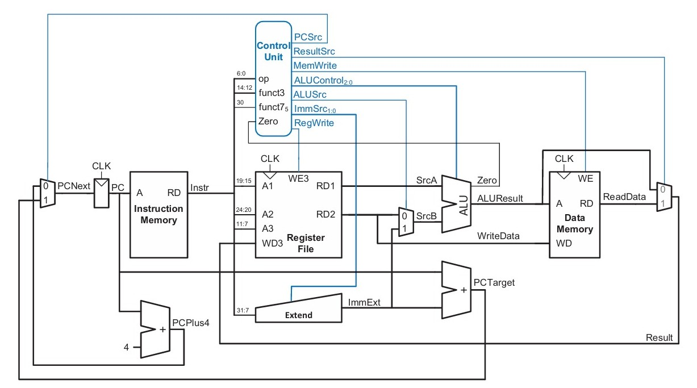
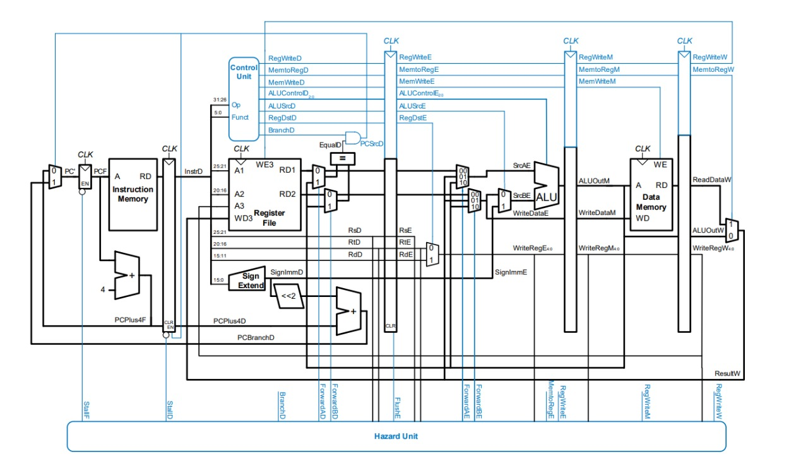

## Pipelined RISC-V RV32I Processor Development
This repository documents the stepwise development of a RISC-V RV32I processor, covering the design of a single-cycle implementation, hardware deployment, pipeline integration, hazard mitigation strategies, and branch prediction mechanisms.

### Single Cycle Processor
A single-cycle implementation provides the foundation for the RISC-V CPU design. All instruction stages are executed in one clock cycle.


  - Implements the base RV32I instruction set.
  - Simple design with direct datapath flow.
  - Serves as a reference for verification of advanced implementations.

### Hardware Implementation
The design is synthesized and deployed on FPGA hardware to validate real-time execution.
  - RTL design written in Verilog.
  - Synthesized using Xilinx Vivado.
  - Verified using testbenches and instruction memory (.hex programs).

### Pipelined Processor
Pipeline architecture enhances throughput by overlapping instruction execution across stages.


  - Five classical stages: IF, ID, EX, MEM, WB.
  - Modularized datapath for easier debugging and extension.
  - Improves instruction throughput compared to single-cycle.

### Hazard Mitigation
Pipelining introduces hazards that must be resolved to maintain correctness.
  - Data Hazards: Handled via forwarding and stalling.
  - Control Hazards: Managed with instruction flushes.
  - Hazard detection unit ensures safe pipeline progression.

### Branch Prediction
Always not taken branch predictor. will be upgraded to a Backward Taken Forward Not Taken predictor(BTFNT) soon

### Repository Structure   
```bash
├── sim_1/
│ ├── imports/t1c_riscv_cpu/
|   ├── rv32i_test.hex          # Hexfile containing opcodes
├── sources_1/new/            # Contains modularized verilog code for pipelined processor
└── README.md                 # This file
```
